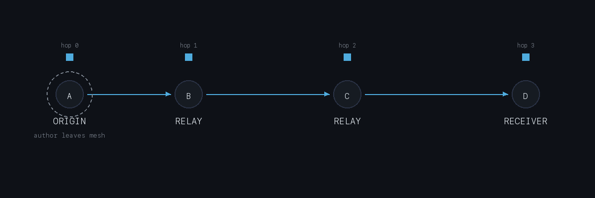

# OLNs

Short notes over BLE mesh. No server, no cell, no Wi-Fi.

Built with Expo SDK 56, React Native 0.85.3, and
[@offline-protocol/mesh-sdk](https://www.npmjs.com/package/@offline-protocol/mesh-sdk)
0.11.0.

## What it does

You write a note, hit broadcast, and it goes out as a BLE service
(`offline-notes.v1`). Phones in range discover it, pull the full body,
save it locally, and relay it with an incremented hop count. The
original author can walk away, the note keeps moving through whoever
is still carrying it.

Use cases are whatever needs infra-free comms: disaster response,
remote field work, festivals, that sort of thing.



Relay stops at `MAX_HOPS = 6`. Past that, devices still display the
note but won't re-advertise it. Six is a guess — enough range without
turning a crowded mesh into a broadcast storm.

**Ghost notes:** BLE peer IDs rotate. Notes store a stable `authorId`
(from AsyncStorage). When the app can't match an author to anyone
currently on the mesh, the feed shows the note greyed out with
SIGNAL LOST. Content stays; you just don't know if the author is
still around.

## Note types

| Type | Color | |
| --- | --- | --- |
| emergency | `#E5433D` | urgent |
| resource | `#3DAE6E` | supplies, help |
| information | `#4FACDE` | general updates |
| waypoint | `#E5A030` | location / direction |

Colors show up on cards, compose, and filters so you can scan the
feed without reading every title.

## Code layout

```
src/
  components/     NoteCard
  identity/       getOrCreateUserId (AsyncStorage)
  mesh/           MeshContext — protocol, relay, ghost detection
  navigation/     stack + tabs
  permissions/    BLE permissions
  screens/        Home, Feed, Compose
  storage/        note persistence
  theme/          colors, typography, spacing
  types/          Note.ts
```

`MeshContext` is the only place that talks to the SDK. Screens use
`useMesh()`.

Each note (`src/types/Note.ts`): `noteId`, `type`, `title`, `body`,
`preview`, `authorId`, `timestamp`, `hopOrigin`, optional `relayedBy`.

Broadcast puts metadata in service capabilities; peers fetch the full
body on `service_request_received` / `service_response_received`.

Discovery polls every 12s while the mesh is running, and also fires
1.5s after `neighbor_discovered` so new peers aren't stuck waiting
for the next interval.

Relay path (`relayNote`): mesh running, not your own note, not already
in `relayedNoteIdsRef`, `hopOrigin < MAX_HOPS`. Random 200–800ms
delay before re-advertising to reduce collisions when several devices
pick up the same note at once.

## Stack

Expo 56 · React Native 0.85 · mesh-sdk 0.11.0 · expo-dev-client ·
react-navigation · AsyncStorage · expo-crypto · react-native-svg ·
IBM Plex Mono + Oxanium

Requires a dev build — won't run in Expo Go (native BLE).

`newArchEnabled` is `false` in `app.json`; mesh-sdk needs legacy arch.

## Setup

**You'll need:** Node 20+, Java 17, Xcode 26+ (Swift 6.2), Android
Studio / SDK 36. Mesh native libs are device-only — simulators fail at
link time.

```bash
git clone https://github.com/robbiekruszynski/OLNsMobile.git
cd OLNsMobile
npm install
npx expo prebuild
```

mesh-sdk disables iOS autolinking. After prebuild, add this inside
`target 'OLNsMobile' do` in `ios/Podfile`:

```ruby
pod 'MeshSdk', :path => '../node_modules/@offline-protocol/mesh-sdk/ios'
```

```bash
cd ios && pod install && cd ..
```

Prebuild wipes `ios/Podfile` — you'll need to re-add that pod line
if you run it again.

**Android** (physical device):

```bash
export ANDROID_HOME=$HOME/Library/Android/sdk
export PATH=$PATH:$ANDROID_HOME/platform-tools
npm run android -- --device
```

**iOS:**

```bash
npm run ios -- --device
```

Other scripts: `npm start` (Metro), `npm run web` (web only — no BLE).

Pinned Android toolchain: Gradle 9.3.1, Kotlin 2.1.20, compileSdk 36.
Don't bump without checking mesh-sdk still builds.

Set `ANDROID_HOME` in your shell or `~/.zshrc` if `adb` isn't found.

## Roadmap (not built yet)

- **Encrypted groups** — passphrase-derived keys, relay without
  read access, membership stored locally
- **Desktop relay nodes** — macOS/Linux client as a fixed relay
- **i18n** — language picker on home is stubbed; i18next planned
- **Note TTL** — stop relaying and drop from storage after expiry

## Credits

[Offline Protocol](https://offlineprotocol.com) mesh SDK.

Original repo (reference): [github.com/robbiekruszynski/OLNs](https://github.com/robbiekruszynski/OLNs)
